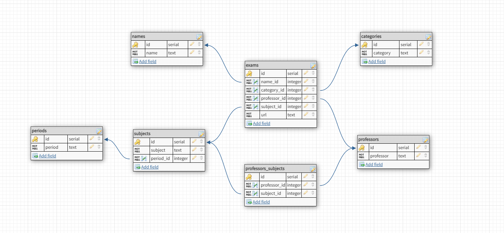

<h1 align="center">
   📑 <a href="#"> RepoProvas API </a>
</h1>

<h3 align="center">
    Share exams easily and anonymously!
</h3>

<h4 align="center"> 
	 Status: Finished
</h4>

<p align="center">
 <a href="#about">About</a> •
 <a href="#database-layout">Database Layout</a> • 
 <a href="#how-it-works">How it works</a> • 
 <a href="#pre-requisites">Pre-requisites</a> • 
 <a href="#tech-stack">Tech Stack</a> • 
 <a href="#how-to-contribute">How to contribute</a> • 
 <a href="#author">Author</a>
</p>


## About

You're a student in the fifth period (and still taking some subjects from the second), and you're angry about one thing: the professors won't release the old exams for you to study. You're in the fifth period (and still taking some subjects from the second), and you're angry about one thing: the professors won't release the old exams for you to study. This is because they reuse their own exams, slightly adapted, so that you don't have to produce new ones. This may be good for them, but the students end up not having any material to practice and feel safe for the exams. RepoProvas was created to solve this problem: a platform designed for people who wants to share their exams anonymously.

---


## Database Layout



The database was designed at https://www.dbdesigner.net/ for PostgreSQL.

``` postgresql

/* In your psql terminal */
CREATE DATABASE repoprovas;

/* Access the database */
\c repoprovas

```
Now, just run the commands listed in <a href="https://github.com/okitauehara/repoprovas-api/blob/main/dump.sql">dump.sql</a>

---

## How it works

This project is divided into two parts:
1. Backend (This repository)
2. Frontend (You can find here: https://github.com/okitauehara/repoprovas)

---

## Pre-requisites

Before you begin, you will need to have the following tools installed on your machine:
[Git](https://git-scm.com), [Node.js](https://nodejs.org/en/), [VSCode](https://code.visualstudio.com/).

### Running the Backend (server)

``` jsx

// Clone this repository
$ git clone git@github.com:okitauehara/repoprovas-api.git

// Access the project folder cmd/terminal
$ cd repoprovas-api

// Install the dependencies
$ npm install

// Create a .env.dev file and fill it using your environment variables following the .env.example

// Run the application in development mode
$ ntl -> start:dev

// The server will start at port: 4000

```
You can find the .env.example <a href="https://github.com/okitauehara/repoprovas-api/blob/main/.env.example">here</a>

---

## Tech Stack

The following tools were used in the construction of the project-api:

**Server**  ([NodeJS](https://nodejs.org/en/))

-   **[Express](https://expressjs.com/)**
-   **[CORS](https://expressjs.com/en/resources/middleware/cors.html)**
-   **[TypeScript](https://github.com/Microsoft/TypeScript)**
-   **[TypeORM](https://github.com/typeorm/typeorm)**
-   **[Ts-node](https://github.com/TypeStrong/ts-node)**
-   **[Ts-jest](https://github.com/kulshekhar/ts-jest)**
-   **[Reflect-metadata](https://github.com/rbuckton/reflect-metadata)**
-   **[NTL](https://github.com/ruyadorno/ntl)**
-   **[Pg](https://github.com/brianc/node-postgres)**
-   **[DotENV](https://github.com/motdotla/dotenv)**
-   **[Faker](https://github.com/Marak/Faker.js)**
-   **[Joi](https://github.com/hapijs/joi)**
-   **[Jest](https://github.com/facebook/jest)**
-   **[Supertest](https://github.com/visionmedia/supertest)**
-   **[Eslint - Airbnb](https://github.com/airbnb/javascript)**
-   **[Prettier](https://github.com/prettier/prettier)**

> See the file  [package.json](https://github.com/okitauehara/repoprovas-api/blob/main/package.json)

**Utilitários**

-   Editor:  **[Visual Studio Code](https://code.visualstudio.com/)**
-   API Test:  **[Thunder Client](https://www.thunderclient.io/)**


---


## How to contribute

1. Fork the project.
2. Create a new branch with your changes: `git checkout -b feat/myFeatureName`
3. For each feature implemented, make a commit specifying what was done
4. Submit your changes: `git push -u origin feat/myFeatureName`

---

## Author

Developed by Marcos Okita Uehara.